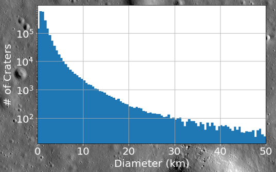
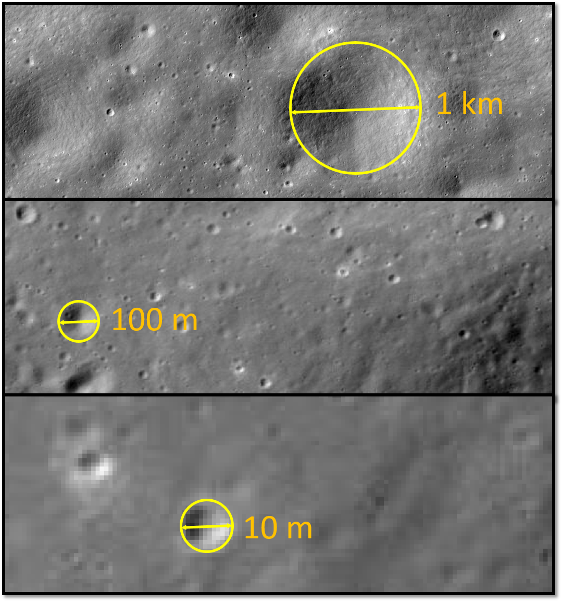
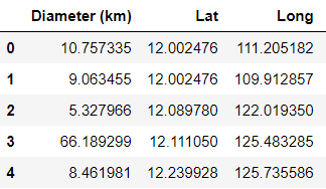

# Crater Detection Tool Project (ongoing)
Developement of an automatic Crater Detection Tool, based on Convolutional Neural Network (CNN). 

## Motivation
The abundance of craters on the Moon (and other planetary bodies) strongly increase with decreasing crater size and we want to be able to detect them all. For scales of 10's m, only an automated crater detection tool can achieve the mission. 

## Goal
Develope a tool which recives a satellite image as an input, and returns a list of all craters within this image, including sizes and locations. It should detect craters of various scales, from several-pixels-size- to full-image-size- craters. 

Using this tool, planetary scientists would be able to: 
1. Create global catalogues: detect, locate and characterize all craters on the Moon and other planetary bodies (such Mars) and surfaces (such commets). 
2. Create a *dynamic* catalogue: scans all new images from lunar satellites and update the cataloge

## Milestones
We began with a great repository named [DeepMoon](github.com/silburt/DeepMoon), which used a global Data Elevation Model (DEM) of the Moon (a topographic map) and a catalog of manually detected craters to train a CNN. They [report](https://arxiv.org/pdf/1803.02192.pdf) a 92% recall on a global-size test set. However for a our purpose this is not sufficient, from number of reasons:
+ The smallest crater detected with the current DEM is of size 3 km. We want to detect craters of size 3 m. 
+ The current model uses DEM and not imagary, which are much more abundant and in higher resolution. 
+ When analyzing a single image, the recall drops to ~60 % per image, which makes this unrelaible. 

Our approach is:
1. To first examine the performence of the existing trained model, and find ways to improve it by examine the data products and the pre- and post-prosessing. 
2. The next step is to retrain it with the improved data and pipeline. 
3. Transfer learning or complete retrain from the DEM-trained model to imagary. 

### Data Products
DeepMoon used a global DEM with a spatial resolution of ~120 m/pix and a catalog consists of ~25K manually detected craters of sizes 5-250 km. By just using better data products we can improve the performence of the trained model: 
+ We used

