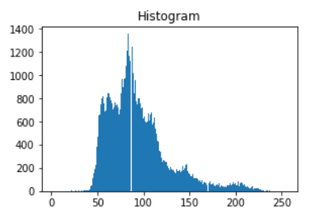

# Crater Detection Tool Project (ongoing)
Developement of an automatic Crater Detection Tool, based on Convolutional Neural Network (CNN). 

## Motivation
Impact craters are important in the research field of planetary evolution as well as for landing site characterization (such as SpaceIL's). They exist everywhere on the Moon, in all sizes. We currently have images which meters size craters can be identified easily by eye: 

However, the abundance of craters strongly increase with decreasing crater size: 

Hence, if one wants to be able to detect all craters of the scale of 1's m, or even 100's m, only an automated crater detection tool can achieve the mission. 

## Goal
Develope a tool which recives a satellite image as an input, and returns a list of all craters within this image, including sizes and locations. It should detect craters of various scales, from several-pixels-size- to full-image-size- craters. 

Using this tool, planetary scientists would be able to: 
1. Create global catalogues: detect, locate and characterize all craters on the Moon and other planetary bodies (such Mars) and surfaces (such commets). 
2. Create *dynamic* catalogues: scans all new images from Lunar & Mars' satellites (current and future) and update the cataloges. 

## Milestones
We began with a great repository named [DeepMoon](github.com/silburt/DeepMoon), which used a global Data Elevation Model (DEM) of the Moon (a topographic map) and a catalog of manually detected craters to train a CNN. They [report](https://arxiv.org/pdf/1803.02192.pdf) a 92% recall on a global-size test set. However for a our purpose this is not sufficient, from number of reasons:
+ The smallest crater detected with the current DEM is of size 3 km. We want to detect craters of size 3 m. 
+ The current model uses DEM and not imagary, which are much more abundant and in higher resolution. 
+ When analyzing a single image, the recall drops to ~60 % per image, which makes this unrelaible. 

Our approach is:
1. To first examine the performence of the existing trained model, and find ways to improve it by examine the **data products** and the **pre- and post-prosessing**. 
2. The next step is to **retrain** it with the improved data and pipeline. 
3. Transfer learn or complete retrain from the DEM-trained model to images. 

### Data Products
There are two data types here: a map/image which is the input for the model, and a list of craters (catalogue) which used to train and measure the model. 
DeepMoon used a global DEM with a spatial resolution of ~120 m/pix and a catalogue consists of ~25K manually detected craters of sizes 5-250 km. By just using better data products we can improve the performence of the trained model significantly. 

+ The original version of the 120 m/pix global DEM, is of 60 m/pix. By simply produce a test set from this source we've been able to detect craters in the scale of 1 km, which is twice and even more smaller than before. 
+ In several places there are local 5 m/pix DEM and sometimes even 2 m/pix, which produced from stereo pairs of LROC high resolution images (such the ones presented above). By creating a test set out of these products we have been able to detect craters of size down to ~250 m. However, the ability to produce a relaiable performence measure in this scale is limited, and we will elaborate upon further. 
+ Recently, a new [catalogue](https://doi.org/10.1029/2018JE005592) was released. This one consist of about 2M craters, all manually detected, from 100's meters to 100's km. It claims for completeness for sizes above 1-2 km. If we compare only the sizes from the old catalogue used in DeepMoon, we get about 75K craters, which is 3 times more:

Without getting here too much into details of the policy of manual crater detection, it is clearly that during training the labled set was missing, meaning that the model learned to ignore most of the craters. We belive that a retrain using this catalogue whould improve the performence significantly. 

### Pre-proccesing
The DEM map was splitted equally into train, validation and test areas. The map was sampled (square crop) randomly in several scales and than downsampled to create a 256x256 pix images, which are the input for the CNN (train/validation/test images). The label of each image is a binary mask of the same size, where all craters edges (taken from the catalogue) in the corresponding area marked with 1. The output of the CNN is a similar float mask, where each pixel represents the probability of it to be an edge of a crater. 

DeepMoon uses a 16-bit global map, but before using it, they lower the precision to 8-bit, which means that there are only 2^8 values in the global map. When the algorithm crops a square, the number of unique values in the image is, naturally, much lower. For example in this image there are 40 unique values: 

However, these represent topographic variations, which are crucial for finding craters, especially in relatively flat areas. Even if for memory consideration one prefer to use 8-bit images, it is better to first crop the image and than lower the bit depth to 8. And so for the same image we get 233 distinct values: 

This technique is especcialy important when searching for the small scale craters, and indeed we mannaged to improve: 

